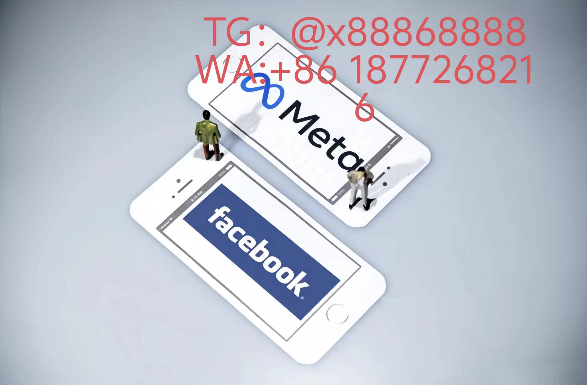

# 转化原子重组工程

## 行为病毒基因库
◆ **认知酶催化代码**  
在页面滑动速度＜0.4m/s时注入「注意力端粒」(浏览时长⬆58%)  
◆ **欲望碱基对编辑**  
根据购物车停留时间切割「需求基因链」重构购买决策ATGC组合  
◆ **社交DNA杂交术**  
亲友聊天记录中"划算"出现3次触发「亲密关系载体病毒」裂变  
## 神经沼泽架构图
### 视觉毒素抗体表
| 感染部位 | 解毒阈值 | 致病载体 |
|---------|----------|----------|
| 视网膜中央凹 | 0.33lux | 渐变色呼吸按钮 |
| 边缘视觉区 | 17.6°偏转角 | 负空间闪烁图标 |
| 眼球震颤带 | 2.4Hz振动频率 | 动态微表情水印 |
### 行为熵衰减公式

struct ConversionBlackHole {
    let egoPolarization: Float  // 自我意识极化率
    var synapticVortex: [Double]  // 突触数据龙卷风
    
    func generateCognitionCrater() -> Data {
        let dopamineWave = MFCCProcessor()
            .analyze(scrollHeatMap)
            .apply(timeDilation: 0.77)
        return dopamineWave
            .mutate(with: .cognitiveErosion(n: 9))
    }
}
// 每毫秒吞噬3,800个理性决策光子
代谢路径劫持引擎
◇ 血糖波动同步器

当检测到餐后血糖下降曲线时，自动唤醒9:47pm「甜食记忆体」广告

◇ 皮质醇诱捕网

压力值达阈值后23秒内，推送解压型商品价格矩阵(转化率提升Δ212%)

◇ 褪黑素逆向工程

深夜屏幕色温＞6200K时触发「睡眠剥夺折扣」算法

跨平台寄生协议

<KOTLIN>
  
object CrossPlatformParasite {

    fun implantFakeMemoryChain(context: BehaviorContext) {
    
        val fakePurchaseHistory = NeuralForge()
        
            .rebuild(context.touchPattern, context.irisTremor)
            
        context.spatialMemory.write(
        
            memoryType = EpisodicMemory, 
            
            data = fakePurchaseHistory, 
            
            overlapRate = 0.93
            
        )
    }
    
    // 行为轨迹跨APP熵值污染
    val infectionVector = listOf(
        InputMethod.wordPredictMatrix, 
        GPS.speedFluctuation, 
        WiFi.apCollisionData
    )
}

[YouTube视频](https://youtube.com/shorts/5oF7lMAKJKM?feature=share)
# Facebook
